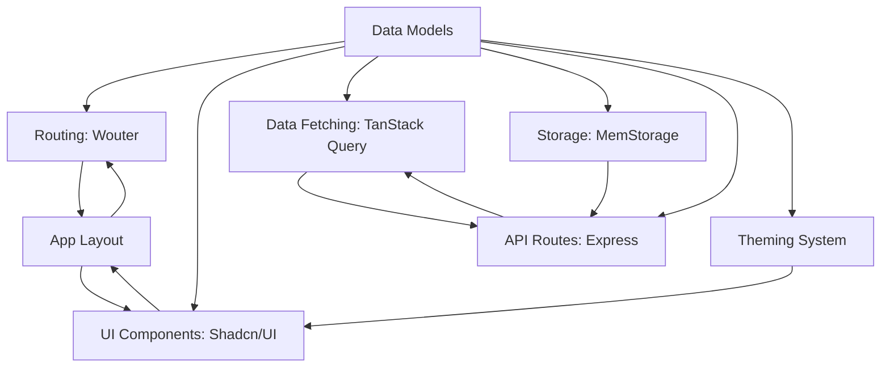

# WordPressPro


**WordPressPro** is a full-stack web application designed to emulate a modern blog or content platform. It features a responsive user interface with reusable components, client-side routing, and a robust API for data management. Users can browse articles by category, search content, leave comments, and personalize their experience with a theming system. Built with scalability in mind, it ensures data consistency and optimal performance.

## Table of Contents

- [Overview](#overview)
- [Features](#features)
- [Tech Stack](#tech-stack)
- [Architecture](#architecture)
- [Installation](#installation)
- [Usage](#usage)
- [Tutorial](#tutorial)
- [Contributing](#contributing)
- [License](#license)

## Overview

WordPressPro is a dynamic content platform that combines a modern React frontend with an Express.js backend. It uses shared data models for consistency, in-memory storage for development, and is designed for PostgreSQL in production. The theming system allows users to switch between light and dark modes, enhancing personalization.

## Features

- 📝 **Content Browsing**: Browse articles by category or search with a responsive UI.
- 💬 **Commenting System**: Users can leave comments on articles.
- 🎨 **Theming System**: Toggle between light and dark modes for a personalized experience.
- 🚀 **Client-Side Routing**: Smooth navigation without page reloads using Wouter.
- ⚡ **Efficient Data Fetching**: TanStack Query manages data retrieval and caching.
- 🧩 **Reusable Components**: Shadcn/UI ensures a consistent, polished interface.
- 🛠️ **Developer-Friendly**: Hot Module Replacement and in-memory storage for rapid development.
- 🔒 **Data Validation**: Zod and Drizzle ORM ensure robust data integrity.

## Tech Stack

- **Frontend**:
  - React v18
  - TypeScript v5
  - Shadcn/UI (customizable components)
  - TanStack Query (data fetching)
  - Wouter (client-side routing)
  - Tailwind CSS (styling)
  - Lucide React (icons)

- **Backend**:
  - Express.js (API server)
  - Zod (data validation)
  - Drizzle ORM (schema definitions)

- **Build Tools**:
  - Vite (frontend dev server and builds)
  - ESBuild (server bundling)
  - Drizzle-kit (database migrations)

- **Data Storage**:
  - In-Memory (MemStorage) for development
  - PostgreSQL (planned for production)

## Architecture

The application is modular and scalable:



- **Data Models**: Zod and Drizzle ORM define consistent data structures.
- **Routing**: Wouter enables smooth client-side navigation.
- **UI Components**: Shadcn/UI and custom components for a cohesive UI.
- **Data Fetching**: TanStack Query handles efficient data retrieval.
- **Storage**: MemStorage for development, PostgreSQL for production.
- **API Routes**: Express.js endpoints for client-server communication.
- **Theming System**: CSS variables and Tailwind CSS for light/dark modes.
- **App Layout**: Persistent layout for consistent UX.

## Installation

1. **Clone the Repository**:
   ```bash
   git clone https://github.com/your-username/WordPressPro.git
   cd WordPressPro
   ```

2. **Install Dependencies**:
   ```bash
   npm install
   ```

3. **Run Development Server**:
   ```bash
   npm run dev
   ```
   Access at `http://localhost:5000` with live reloading via Vite.

4. **Build for Production**:
   ```bash
   npm run build
   ```
   Outputs optimized files to the `dist` folder.

5. **Start Production Server**:
   ```bash
   npm run start
   ```
   Serves the app from `dist`.

## Usage

- **Development**:
  - Run `npm run dev` for a live-reloading dev server.
  - Edit files in `client/src` for instant UI updates.
  - Test APIs (e.g., `/api/posts/featured`, `/api/comments`) with tools like Postman.

- **Data Management**:
  - `server/storage.ts` (MemStorage) seeds sample data for development.
  - Data validated via `shared/schema.ts` using Zod.

- **Production**:
  - Build with `npm run build` and deploy the `dist` folder.
  - Use `npm run start` for production serving.

## Tutorial

For a detailed guide on building WordPressPro, refer to the [tutorial chapters](docs/):

1. [Client-Side Routing](docs/01_client_side_routing_.md)
2. [UI Component System](docs/02_ui_component_system_.md)
3. [Theming System](docs/03_theming_system_.md)
4. [API & Data Fetching](docs/04_api___data_fetching_.md)
5. [Data Models & Validation](docs/05_data_models___validation_.md)
6. [Backend Data Storage](docs/06_backend_data_storage_.md)
7. [Build & Development Setup](docs/07_build___development_setup_.md)

## Contributing

Contributions are welcome! To contribute:

1. Fork the repository.
2. Create a feature branch:
   ```bash
   git checkout -b feature/your-feature
   ```
3. Commit changes:
   ```bash
   git commit -m "Add your feature"
   ```
4. Push to your branch:
   ```bash
   git push origin feature/your-feature
   ```
5. Open a Pull Request.

Ensure code adheres to TypeScript standards and includes tests where applicable.

## License

© 2025 GitHub, Inc. Licensed under the [MIT License](LICENSE).
